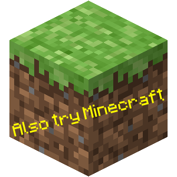

#  ft_vox

<em>Y me doy el lujazo...</em>

---

# Objective ❓

This project aims to confront **ME** to a graphic project that will be extremely demanding in terms of optimization. I will have to study the characteristics of the voxel worlds, and use them along my infographics knowledge to display a lot of elements on screen. Thus, I will have to study different algo/opti to obtain a SMOOTH render (there are many of them). I will also have to manage my memory and data structures properly to be able to travel in a very, very large universe. Once I have achieved that, I will be ready to get to the next level with a full Minecraft clone, which will be even more demanding.

---

# Dependencies 📦

- <a href="https://www.glfw.org/"> **GLFW**</a>
- <a href="https://github.com/g-truc/glm"> **GLM**</a>
- <a href="https://github.com/ocornut/imgui"> **ImGui**</a>
- <a href="https://github.com/nothings/stb">**STB**</a>
- <a href="https://glad.dav1d.de/"> **GLAD**</a>

---

# Progress ⏳

The current ft_vox isn't but a single black window... 📺

---

# TODO 🤯
- [ ] or not TODO, that is the question...